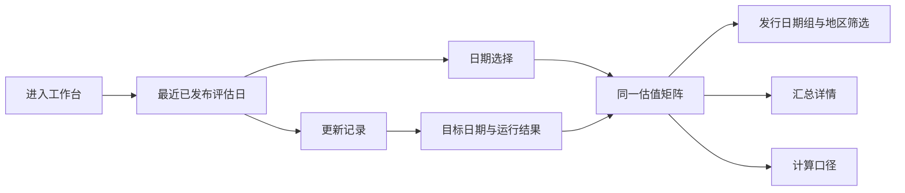
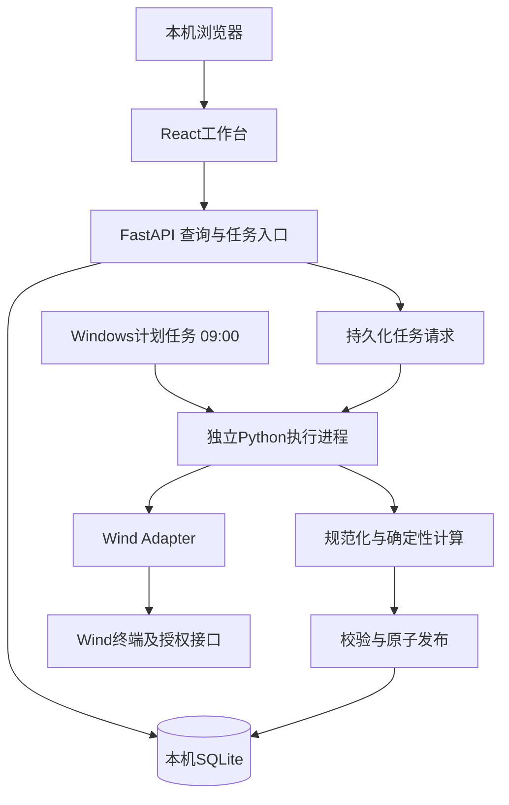

# 地方债行情工作台：产品、前端与开发设计

设计版本：V1.1　设计日期：2026-09-11

业务依据：[地方债行情监测工具需求文档](/C:/Users/Admin/Documents/ChatGPT/wind工作台/outputs/地方债行情监测工具-需求文档.md)。

本设计将已确定的数据处理要求落到工作台页面、交互、数据契约和开发架构。计算口径以需求文档为准，本文补充实现方式。本次交付为设计文档，尚未开发、连接Wind或启动定时任务。

## 1. 产品方案

工作台采用**桌面浏览器中的地方债估值矩阵**作为主界面。用户进入后能立即确认正在查看哪一天的数据，在同一张矩阵中切换发行日期组和历史日期，并查看数据更新是否成功。

首版采用**本地部署、单用户使用**：浏览器界面与具备Wind取数能力的Windows主机配合，数据保存在该主机。此部署形态是本次架构选择。

### 1.1 工作台承接的工作

| 用户要完成的工作 | 页面提供的能力 |
|---|---|
| 查看最近可用数据 | 默认展示最近已发布的评估日，并标出真实日期 |
| 查看某一天 | 在主页面选择历史日期，保持相同表格结构 |
| 查看某组地方债 | 切换发行日期组，按地区档位或债券口径筛选展示 |
| 理解某个汇总值 | 查看该格所属地区、期限、类型、计算口径及汇总依据 |
| 确认每天有没有更新 | 查看最近运行状态，进入更新记录检查目标日期和结果 |
| 恢复失败的更新 | 对失败日期发起重试，继续保留已有成功结果 |

界面围绕已要求的估值、更新与历史查询设计。AI用于辅助开发和维护，正式取数、筛选及加权计算由固定代码执行，不依赖大模型对数据临时判断。

### 1.2 业务口径对应关系

| 需求中的固定规则 | 设计中的落点 |
|---|---|
| 按发行规模加权 | 后端计算模块执行，前端展示计算结果 |
| 2025-08-08前、当天及以后分组 | 两个发行日期标签，不能合并两组 |
| 剩余期限四舍五入，只留3/5/7/10/15/20/30 | 后端统一筛选；表头固定七个期限 |
| 剔除缺失、非正发行规模、提前偿还和赎回条款债 | 后端筛选，更新记录保存筛选数量 |
| 有效零收益率保留 | 页面显示0.0000，与无样本“—”区分 |
| 37个地区、一二三档，兵团单列第三档 | 固定地区顺序和分段行 |
| 整体、一般债、专项债 | 三个列组，每组七列 |
| 每天09:00处理前一自然日 | 独立调度，显示运行时间与目标评估日期 |
| 2026-09-01起保留历史 | 日期选择范围与首次回补起点一致 |
| 长期保存逐地区汇总，个券历史非必需 | 当前与历史使用同一矩阵，详情不依赖历史个券清单 |

## 2. 信息架构

设置三个主导航入口；V1.1按用户要求新增Wind数据源配置界面。历史查询复用主页面，不单独维护另一套历史报表。

| 入口 | 路由 | 内容 |
|---|---|---|
| 估值工作台 | `/workbench` | 日期选择、发行日期标签、地区筛选、估值矩阵 |
| 更新记录 | `/runs` | 日常更新、回补及重试的运行记录 |
| Wind数据源 | `/sources` | 官方债券MCP配置、鉴权输入、配置状态与数据能力验证状态；见第16节 |

另有两个轻量浮层：

- **计算口径抽屉**：查看固定规则，不提供修改权重、日期分界或公式的编辑入口。
- **汇总详情抽屉**：查看所选单元格的分组信息与已保存汇总依据。



## 3. 主页面布局

### 3.1 布局示意

以下为结构示意，日期和横线为版面示例，不代表已经取得Wind数据。实际页面每个债券口径包含全部七个期限。

```text
┌──────────────────────────────────────────────────────────────────────────────┐
│ 地方债行情工作台                                      更新记录   计算口径    │
├──────────────┬───────────────────────────────────────────────────────────────┤
│ 估值工作台   │ 地方债估值                                                    │
│ 更新记录     │ 评估日期 2026-09-10    本结果生成于…    最近任务：…            │
│              │                                                               │
│              │ [评估日期 ▾] [最新可用]   [刷新结果]                            │
│              │ [2025-08-08前发行] [2025-08-08当天及以后发行]                  │
│              │ 档位 [全部 ▾]   [搜索地区]   显示口径 [全部 ▾]                │
│              │                                                               │
│              │ 中债估值收益率（%）· 按发行规模加权                            │
│              │ ┌────────────┬──────────────┬──────────────┬──────────────┐   │
│              │ │ 地区       │ 整体         │ 一般债       │ 专项债       │   │
│              │ │            │ 3Y … 30Y     │ 3Y … 30Y     │ 3Y … 30Y     │   │
│              │ ├────────────┴──────────────┴──────────────┴──────────────┤   │
│              │ │ 一档                                                   │   │
│              │ │ 上海市       — … —          — … —          — … —       │   │
│              │ │ 北京市       — … —          — … —          — … —       │   │
│              │ │ ……                                                     │   │
│              │ │ 二档                                                   │   │
│              │ │ ……                                                     │   │
│              │ │ 三档                                                   │   │
│              │ │ 新疆维吾尔自治区                                       │   │
│              │ │ 新疆生产建设兵团                                       │   │
│              │ └────────────────────────────────────────────────────────┘   │
│              │ — 表示当前分组无合格样本。有效零收益率显示为0.0000。           │
└──────────────┴───────────────────────────────────────────────────────────────┘
```

### 3.2 尺寸与密度

| 区域 | 设计规格 |
|---|---|
| 主要使用环境 | Windows桌面浏览器，优先覆盖1440×900与1920×1080 |
| 应用顶栏 | 高56px，显示产品名和轻量全局入口 |
| 左侧导航 | 展开宽176px，紧凑布局可收起为56px |
| 主内容 | 内边距24px，标题、控制区和表格共享左边线 |
| 状态区 | 紧凑一至两行，分别标明评估日期、结果生成时间、最近任务状态 |
| 表格地区列 | 168px，较长地区名称允许两行，保持可辨认 |
| 数值列 | 最小64px，三个列组合计21列 |
| 表头 | 两层，每层32px；分组表头与期限表头一起固定 |
| 普通数据行 | 基准36px，长地区名称行可增高 |
| 档位分段行 | 28px，使用淡底色和文字标题 |
| 详情抽屉 | 桌面宽400px，窄屏占满可用宽度 |

完整表格最小宽度为`168 + 21×64 = 1512px`。空间不足时，表格内部横向滚动，地区列固定。需要集中查看时，用户可将“显示口径”切换为整体、一般债或专项债，此时只显示对应七列。页面不通过缩小数字字号强行塞入21列。

### 3.3 视觉规范

| 项目 | 设计值 |
|---|---|
| 页面背景 | `#F4F6F9` |
| 表格、抽屉背景 | `#FFFFFF` |
| 主文字 | `#172033` |
| 次文字 | `#526077` |
| 边线 | `#DDE3EB` |
| 主要操作、选中态 | `#2563EB` |
| 成功状态 | `#167D55`，同时显示状态文字 |
| 待处理、更新中 | 蓝色或中性色，并显示文字 |
| 失败状态 | `#B42318`，搭配简短原因 |
| 标题／正文／数值 | 22px／14px／13px |
| 数字排版 | 等宽数字，右对齐，小数位对齐 |
| 圆角 | 控件6px、容器8px |

采用浅色、高密度数据界面。收益率数字保持中性色，不用红绿表示“好坏”；只有运行状态使用语义色。界面中的技术错误应转成可理解的业务说明。

## 4. 核心交互

### 4.1 日期选择

1. 首次打开且URL没有日期时，由服务端返回最近一个`ready`评估日。
2. 日期范围为2026-09-01至服务端确定的前一自然日。之前和未来日期不可选。
3. 日历标出已有结果、无独立估值、尚未处理及首次失败日期，并提供文字说明。
4. 日期切换只读取历史快照，不触发Wind取数。
5. 用户主动选择无数据、待处理或失败日期时，停留在该日期并显示对应状态。
6. “最新可用”按钮显式切换至最近已发布日期。
7. 新日期结果发布时，正在查看旧日期的用户收到“有新日期数据，可查看最新”的轻提示；保持当前选择，点击后再切换。

切换日期期间，先清除旧矩阵或显示骨架。不能在新日期标题下暂时显示上一日期的数值。

### 4.2 发行日期、档位和债券口径

| 控件 | 行为 |
|---|---|
| 发行日期标签 | “2025-08-08前发行”“2025-08-08当天及以后发行”；默认前者，切换读取同一日期快照中的另一组 |
| 档位筛选 | 全部／一档／二档／三档，只筛选展示行 |
| 地区搜索 | 在当前地区清单中按名称查找，保留结果的原始排序 |
| 显示口径 | 全部／整体／一般债／专项债，只改变可见列，默认全部 |
| 刷新结果 | 重新读取已保存结果和运行状态，不等同于重新取数 |

筛选之间取交集。没有匹配地区时显示“未找到匹配地区”，不将其表述成“当日无估值”。无样本地区仍保留行，避免不同日期的地区位置变化。

URL保存`date、cohort、tier、scope、region`等视图参数。刷新页面能恢复当前日期和筛选，不在URL中存放数据值或Wind凭据。

### 4.3 单元格与详情

- 表格标题统一标注“中债估值收益率（%）· 按发行规模加权”。
- 默认显示四位小数，例如接口值`"1.75000000"`显示为`1.7500`。
- 有效数值0显示`0.0000`；空组显示`—`，悬停或聚焦说明“当前分组无合格样本”。
- 点击或按Enter打开汇总详情，显示日期、发行日期组、地区、档位、期限、债券口径、加权收益率、样本数、发行规模合计与公式。
- 样本数和发行规模合计由后端随汇总保存，用于解释和核对当前值，不新增市场评价指标。
- 历史个券可能未保存，因此详情不承诺进入逐券清单，也不以当前个券缓存解释历史样本。
- 筛选或日期改变后，关闭不再属于当前视图的详情，避免抽屉与矩阵日期不一致。
- 汇总详情和计算口径抽屉均绑定`evaluationDate + publishedRunId`。同一日期发布新版本时，与矩阵同步切换快照，或关闭旧抽屉；不能继续展示旧版本的样本数、发行规模合计或规则说明。

### 4.4 计算口径抽屉

显示固定规则摘要、37个地区的分档、发行日期分界、剩余期限区间、发行规模加权公式、剔除条件、有效零值与空值的区别、历史起点及调度时间。显示当前快照对应的规则版本。

公式说明只读。页面不会因用户操作临时改变业务规则。

## 5. 页面状态与文案

日期数据状态和任务执行状态必须分别处理。

| 场景 | 主页面表现 |
|---|---|
| 已发布且有合格样本 | 正常矩阵，明确日期与结果生成时间 |
| 某组没有样本 | 该格为“—”，其他结果正常 |
| 当日有真实估值，但全部记录被筛除 | 日期仍为已完成；显示全“—”矩阵，说明“已完成计算，无符合口径的债券” |
| 数据源确认当日没有独立估值 | 显示“当日无估值数据”，提供日期选择和最新可用入口 |
| 日期尚未处理 | “该日期尚未处理”，显示日常任务或回补状态 |
| 首次更新进行中 | “正在获取该日期数据”，显示真实处理阶段 |
| 首次更新失败 | “该日期数据获取失败”，显示简短原因及查看更新记录入口 |
| 已有成功结果，正在重试／重新计算 | 保留旧矩阵及其生成时间，状态区显示“正在更新” |
| 已有成功结果，最近一次更新失败 | 保留旧矩阵；提示“本次更新失败，当前显示上次成功结果” |
| 已有成功结果，来源本次未返回新估值 | 保留已有成功结果，显示本次检查说明，不将旧结果撤销为无数据 |
| 前端查询失败 | “结果加载失败”，提供重新加载；不把网络故障显示成空组 |
| 第一次部署尚无任何成功日期 | 展示初始化状态与回补进度，不展示假数据 |

更新进行中的阶段为“获取名单 → 获取数据 → 筛选计算 → 保存结果”。只有取得真实总数和已完成数量时才显示比例，其他情况显示阶段文字，不模拟百分比。

## 6. 更新记录页面

### 6.1 内容与操作

按最近执行时间排列记录，默认每页30条。

| 字段 | 显示含义 |
|---|---|
| 目标评估日期 | 本任务处理哪一天 |
| 执行类型 | 每日更新／初始回补／历史补取／手动重试 |
| 开始、结束时间 | 北京时间；与目标评估日期分列 |
| 状态 | 排队中、运行中、成功、失败；成功结果可为有数据或当日无估值 |
| 数据处理结果 | 来源记录数、去重后记录数、合格样本数及主要剔除数量 |
| 结果说明 | 简洁原因，如“Wind连接失败”“已保存该日汇总” |
| 操作 | 查看该日结果；失败记录提供重试 |

重试发起后台任务，立即返回任务编号，不阻塞页面。相同日期已有排队或运行任务时复用该任务，不重复发起。运行记录只显示必要说明，完整错误细节保存在本机日志。

### 6.2 操作的区分

| 操作 | 是否访问Wind | 是否改变历史结果 |
|---|---:|---:|
| 切换日期、档位、发行日期组 | 否 | 否 |
| 刷新结果／重新加载页面 | 否 | 否 |
| 重试失败任务 | 是，由后台执行 | 仅在完整成功后发布对应日期的新结果 |
| 每日更新和历史补取 | 是，由后台执行 | 成功后更新对应日期，其他日期不变 |

## 7. 前端实现设计

### 7.1 技术方案

采用**React + TypeScript + Vite + CSS Modules**。工作台属于状态明确的单页数据应用，生产环境由后端提供Vite构建后的静态文件。Vite的生产构建适合静态资源部署，开发服务器不作为正式运行服务。[Vite生产构建](https://vite.dev/guide/build)、[静态部署说明](https://vite.dev/guide/static-deploy.html)

表格采用原生HTML表格与CSS固定表头、固定地区列。37行数据无需引入虚拟化。日期选择器、菜单和抽屉采用统一的基础组件，复杂交互必须通过键盘检查。

### 7.2 组件结构

```text
AppShell
├─ Sidebar
├─ WorkbenchPage
│  ├─ DatasetStatusBar
│  ├─ WorkbenchToolbar
│  │  ├─ EvaluationDatePicker
│  │  ├─ IssueCohortTabs
│  │  ├─ TierFilter
│  │  ├─ RegionSearch
│  │  └─ BondScopeFilter
│  ├─ ValuationMatrix
│  │  ├─ MatrixHeader
│  │  ├─ RegionSection
│  │  └─ YieldCell
│  ├─ AggregateDetailDrawer
│  └─ CalculationRulesDrawer
└─ RunsPage
   ├─ RunsTable
   └─ RunDetailPanel
```

前端负责读取、筛选、格式化和交互。后端负责债券筛选、分组、加权及完整性判断。前端不会从可见行重新计算“整体”或按档合计。

### 7.3 状态管理与请求

- URL保存视图状态；抽屉开关和当前选中单元格使用页面局部状态。
- 按评估日期缓存服务端快照。每次读取一个日期的完整1,554个汇总位置，发行日期组、档位及债券口径切换在前端筛选。
- 请求日期发生变化时取消旧请求，响应还需检查日期键，避免较慢的旧响应覆盖新日期。
- 读取结果时同时接收`publishedRunId`。结果内容与元信息必须属于同一个已发布快照。
- 矩阵与两个抽屉共享日期和发布版本键；同日重新发布也必须使旧抽屉状态失效，不能只依赖日期变化刷新。
- 页面可见且相关任务运行中时，每5秒查询任务状态；空闲时每60秒轻量检查状态。标签页隐藏时暂停轮询。
- 新版本发布后重新获取完整快照，一次替换矩阵，不逐格混合旧新结果。
- 其他日期更新成功时保持用户选择，通过“查看最新”入口切换。

### 7.4 数值与单位

HTTP传输中的收益率、发行规模、加权分子分母使用十进制字符串；`null`专门表示无结果。

- `yieldPct="1.75"`表示1.75%，页面显示`1.7500`，不能再次乘100。
- 发行规模统一为亿元，字段名带`Yi`或明确单位。
- 前端使用decimal.js从字符串进行显示舍入，四位小数采用`ROUND_HALF_UP`，不参与业务汇总。[decimal.js文档](https://mikemcl.github.io/decimal.js/)
- 判断空值时显式检查`null`，不能使用`value || "—"`等会误伤零值的表达式。

### 7.5 可访问性与适配

两级列头分别关联债券口径和期限，地区作为行头。使用`caption、th、scope、headers`建立关联，兼顾多级表头的读屏体验。[W3C多级表头设计](https://www.w3.org/WAI/tutorials/tables/irregular/)

- 状态同时使用文字和颜色。
- 单元格详情可由键盘打开；方向键移动单元格焦点，Enter打开，Escape关闭并返回原单元格。
- 表头与固定地区列具有不透明背景和合理层级，滚动时不重叠透字。
- 1280px以下收起侧栏，工具条允许换行；数值列宽保持，表格内部滚动。
- 小屏使用同一数据结构，允许切换为单个债券口径查看七列，不重排成丢失期限对应关系的卡片。

## 8. 开发架构

### 8.1 部署结构



选择Python承接Wind接口及Decimal计算。FastAPI提供本机查询和任务入口，Wind调用在独立进程执行。FastAPI文档将请求内后台任务与更独立的后台执行方式区分；本设计为使更新不依赖网页请求生命周期，使用独立执行进程。[FastAPI后台任务说明](https://fastapi.tiangolo.com/tutorial/background-tasks/)

SQLite使用WAL模式，浏览器查询与后台写入可以并行，写任务仍串行。数据库放在本机磁盘；WAL要求参与访问的进程位于同一主机，不将数据库放入网络共享目录。[SQLite WAL](https://www.sqlite.org/wal.html)

前端和HTTP入口使用同源访问，服务默认仅绑定本机回环地址。写操作使用POST并校验来源。Wind凭据、接口调用与原始错误报文保留在本机后端。

### 8.2 核心模块与小接口

| 模块 | 对外接口示意 | 内部承担的工作 |
|---|---|---|
| WindSnapshotReader | `fetch(date) -> SourceSnapshot / NoPublishedData` | 连接、批次、字段映射、实际估值日期、来源完整性、错误分类 |
| ValuationCalculator | `calculate(snapshot, rules) -> SnapshotDraft` | 规范化、去重、缺失与条款剔除、剩余期限分类、发行规模加权 |
| SnapshotStore | `publish(draft, runId)`、`read(date)` | 事务、版本指针、整日可见性、旧结果保护、汇总历史 |
| UpdateRunner | `execute(date, trigger)` | 运行记录、独立进程、单实例锁、回补、失败恢复 |
| WorkbenchQuery | `getDay(date)`、`getCalendar(month)` | 组合日期状态、当前快照、最近任务及对应地区映射 |

Wind Adapter与固定测试数据Adapter满足相同取数接口，前端和计算测试不必连接真实Wind。计算模块返回结果，不直接写数据库。存储使用临时SQLite测试事务行为，避免用简单内存替身掩盖发布问题。

### 8.3 单日处理流程

1. 将目标评估日期写入任务记录，取得全局Wind执行锁。
2. 获取该日期的债券范围和来源数据状态。
3. 如来源明确当日没有独立估值，记录`no_data`结论；连接异常或批次失败则记录任务失败。
4. 获取全部请求债券的返回结果，包括明确的单券缺失状态，检查批次完整性。
5. 标准化日期、收益率单位、发行规模单位、地区及债券身份。
6. 对每只债券按需求规则筛选，计算`ROUND_HALF_UP(剩余期限, 0)`，只保留七个目标整数。
7. 对分界日前／当天及以后、地区、期限、债券类型累计分子和分母。
8. 生成37×2×7×3个固定位置。没有样本的位置保存空值；当日存在真实估值但所有债券被剔除时，仍属于成功计算。
9. 校验结果后原子发布，更新运行记录。

Python使用Decimal及明确的`ROUND_HALF_UP`，不使用默认`round()`处理0.5边界。发行规模为正，分子和分母来自同一批有效债券。[Python Decimal](https://docs.python.org/3/library/decimal.html)

“整体”直接对全部合格个券累计，或将一般债与专项债的分子、分母分别相加后再相除，不能对两个平均收益率直接求平均。

## 9. 日期、任务与单元格的数据状态

### 9.1 状态定义

| 对象 | 字段与取值 | 含义 |
|---|---|---|
| 日期 | `dataState: pending / ready / no_data` | 尚无结论／已有有效快照／来源确认无当日估值 |
| 任务 | `status: queued / running / succeeded / failed` | 本次执行的状态 |
| 成功任务结果 | `outcome: data / no_data` | 发布了数据或完成无数据确认 |
| 单元格 | `cellState: value / no_samples` | 有结果或无合格样本 |

首次任务失败时日期仍没有有效快照，页面结合最近任务显示失败。已有快照的日期重试失败，日期仍为`ready`，最近任务为`failed`。前端不得用“最新任务”替代“当前成功快照”。

### 9.2 来源完整性

- 来源完整正常响应中的个券缺失，按需求剔除该券。
- 全量名单不完整、关键批次超时或请求失败，不能把已取到的部分数据发布成完整日结果。
- 不能仅因所有个券被剔除就判断当日无估值。
- 不能仅因星期六、星期日就判断无数据。
- 若目标日查询返回前一日填充值，必须识别实际所属日期，不当作目标日新估值。
- 已有成功快照时，后续一次无数据响应不撤销成功快照；运行记录保留本次响应结论。

## 10. 数据库设计与发布一致性

长期保存汇总结果，原始全量数据可作为当次处理文件或短期缓存，不作为历史查询的必需依赖。

### 10.1 核心表

| 表 | 主要字段 | 约束与用途 |
|---|---|---|
| `region_config` | `mapping_version, region_id, name, tier, display_order` | 主键为版本与地区；映射版本发布后不原地改写 |
| `valuation_dates` | `valuation_date, data_state, published_run_id, latest_run_id, checked_at` | 日期唯一；成功结果指针和最近任务指针分开 |
| `job_runs` | `run_id, target_date, trigger_type, status, outcome, phase, created_at, started_at, finished_at, rule_version, mapping_version, source_count, eligible_count, exclusion_counts, error_code` | 保存一次任务及其计算版本、数量摘要；同一日期最多一个queued或running任务 |
| `aggregate_results` | `run_id, cohort, region_id, term_years, bond_scope, yield_pct, sample_count, issue_amount_sum_yi, weighted_yield_sum` | 唯一键为运行编号加四个分组维度；数值以十进制字符串保存 |

`yield_pct`可为空；其他累计字段保存计算依据。`sample_count=0`时收益率为空值、规模合计和加权分子为0。收益率为有效零值时样本数必须大于0，规模合计必须大于0。

地区名称、档位与排序按该快照的`mapping_version`读取，避免日后调整地区映射改变历史展示。

### 10.2 原子发布

1. 全部取数、筛选和计算完成后，先完成结果校验。
2. 在单个写事务中写入新运行对应的全部聚合结果，更新日期的`published_run_id`与`data_state`，并将任务标记成功。
3. 提交成功后新结果才对查询生效；失败则回滚，旧指针和旧成功结果不变。
4. 矩阵查询在同一个读事务内读取日期指针、地区版本和该运行的所有结果。
5. 新结果生效后，可清理该日期旧运行的聚合值；保留任务日志。清理不能影响正在读取的完整快照。

上述步骤用于`outcome=data`。`outcome=no_data`时，不写聚合结果、不设置新的`published_run_id`；在同一事务中完成任务并更新检查时间。此前没有成功快照时，将日期状态设为`no_data`；已有成功快照时，保留`ready`和原`published_run_id`。运行失败同样不能撤销已有日期结论或快照。

状态约束：`ready`必须指向状态为`succeeded`、结果为`data`的完整运行；`pending`和`no_data`不带有效快照指针。

SQLite的事务隔离保证读者看到完整提交结果；本设计进一步要求元信息和数值在同一读事务内读取。[SQLite事务隔离](https://www.sqlite.org/isolation.html)

同一日期只有一个当前有效结果版本，重新计算不会产生重复的当前历史记录。每个数据日最多1,554个汇总位置。

## 11. 前后端接口契约

以下路径为开发设计，尚未部署。

| 方法与路径 | 返回内容或行为 |
|---|---|
| `GET /api/bootstrap` | 服务端日期、时区、历史起点、可选日期上限、最近已发布日期、最近任务摘要 |
| `GET /api/calendar?month=2026-09` | 当月各日期的数据状态与最近任务状态 |
| `GET /api/datasets/{date}` | 该日期状态、当前已发布快照、对应地区映射、全部汇总位置 |
| `GET /api/rules?version=...` | 对应规则版本的只读说明与参数 |
| `GET /api/runs?cursor=...` | 分页运行记录及简短统计 |
| `GET /api/runs/{runId}` | 单次任务的进度、结果和可展示原因 |
| `POST /api/runs` | 为失败日期请求重试，返回202和运行编号；同日活跃任务复用 |

`POST /api/runs`请求只提交目标日期和`manual_retry`触发类型，不接收前端传入的新公式、权重或地区映射。非法日期返回400，未知运行编号返回404。日期尚未处理、当日无估值是正常业务状态，查询返回200及明确状态。

### 11.1 单日结果示例

下例仅说明接口结构，数值是合成样例，不是真实Wind结果。正式成功响应包含全部1,554个位置。

```json
{
  "evaluationDate": "2026-09-10",
  "dataState": "ready",
  "snapshot": {
    "publishedRunId": "example-run-001",
    "publishedAt": "2026-09-11T09:03:00+08:00",
    "rulesVersion": "rules-v1",
    "mappingVersion": "regions-v1",
    "yieldUnit": "percent",
    "issueAmountUnit": "yi_cny",
    "regions": [
      {"id": "shanghai", "name": "上海市", "tier": 1, "order": 1}
    ],
    "cells": [
      {
        "cohort": "before_20250808",
        "regionId": "shanghai",
        "termYears": 10,
        "bondScope": "general",
        "cellState": "value",
        "yieldPct": "1.75000000",
        "sampleCount": 2,
        "issueAmountSumYi": "40",
        "weightedYieldSum": "70"
      }
    ]
  },
  "latestAttempt": {
    "runId": "example-run-002",
    "status": "failed",
    "outcome": null,
    "message": "Wind连接失败"
  }
}
```

该例明确表达：所选日期有可用结果，最近一次重试失败。页面继续显示`example-run-001`，不能因`example-run-002`失败清空矩阵。

`cohort`仅有`before_20250808`与`on_or_after_20250808`；`bondScope`为`all / general / special`；`termYears`只允许七个指定整数。无快照的日期返回`snapshot: null`，不会用空数组暗示一张有效的全空矩阵。

## 12. 调度、回补和本机运行

### 12.1 调度方式

- Windows计划任务每天北京时间09:00启动独立Python执行入口。
- 日常入口首先处理前一自然日，再逐日补取历史范围内因失败、延迟或未运行而缺失的数据。
- 初始部署使用同一流水线回补2026-09-01至运行前一天；当前存续名单不能替代历史债券范围。
- 设置错过触发后的补跑，恢复后按实际目标日期查漏。Windows提供`StartWhenAvailable`选项，补跑并不意味着准点执行。[Microsoft计划任务说明](https://learn.microsoft.com/en-us/windows/win32/taskschd/tasksettings-startwhenavailable)
- 每日任务、手动重试和回补共享同一个执行入口，使用本机进程互斥锁，Wind调用串行。
- 任务先持久化后启动执行进程。进程中断后锁由操作系统释放；下次取得锁时将遗留运行标记为中断失败，再继续补取。
- API发起重试只写入队列并唤醒相同执行入口。页面关闭不会停止已经开始的任务。

`job_runs`同时承担持久化队列。数据库对同一目标日期处于`queued`或`running`的任务设置部分唯一索引；入队与更新`latest_run_id`在同一事务内完成。并发入队发生冲突时返回现有活跃任务。执行进程等待本机互斥锁，取得锁后按入队顺序逐项原子认领`queued`任务并执行，直到队列排空。锁被占用时不能直接丢弃本次唤醒；等待发生在独立进程，不阻塞HTTP请求。

每日主任务完成后，枚举2026-09-01至前一自然日仍无成功快照的日期，包括`pending`、`no_data`及首次失败日期，主动重新检查来源可用性。已发布独立估值的日期进入补取，仍无估值的日期更新检查时间；已排队或运行中的日期复用任务。每轮调度对同一日期最多检查一次，避免对无估值日期反复循环。这样既保留已确认的无估值结论，也能发现并补齐迟到数据。

### 12.2 运行前提

部署主机需安装并授权Wind终端和相应Python接口，验证Python解释器兼容性、Windows用户上下文及登录要求。Wind官方提供Windows终端安装资料；具体API字段和接口行为以所用终端的官方字典及实机验证为准。[Wind官方下载中心](https://wind.com.cn/download.htm)

09:00定义为任务开始时间，完成时间由数据量和Wind响应决定。页面关闭不影响独立任务；主机关机或Wind不可用时，系统在恢复后补取并显示实际完成时间。不能在尚未验证登录条件时假定Wind接口可在无人登录的系统服务中使用。

## 13. Wind接入与计算实现检查

以下为工程验证事项，由开发解决，不要求用户重新决策已确定的业务口径。

| 检查点 | 接入完成条件 |
|---|---|
| 历史全量地方债名单 | 能覆盖目标评估日存在的地方债，包括如今已到期的历史债券 |
| 估值真实日期 | 能识别正常当日估值、前值填充、缺失及接口错误 |
| 剩余期限 | 取目标日剩余期限，不能使用今日字段代替历史值 |
| 发行规模 | 从官方字段字典确认发行规模定义、单位及续发行行为，不改用存量余额，不把目标日之后发行的规模带入历史 |
| 稳定债券身份 | 通过可靠身份处理同券跨市场记录，不仅靠简称或删除代码后缀去重 |
| 提前偿还与赎回 | 区分存在、不存在和未知；未知按计算所需信息缺失处理 |
| 地区与兵团 | 用主体身份明确映射，兵团与新疆维吾尔自治区分别统计 |
| 批次完整性 | 每个请求对象都取得正常返回或明确缺失状态，超时批次不会被当成成功 |
| 单位与精度 | 统一收益率百分数和发行规模亿元，Decimal计算，不在累计前显示舍入 |

取数接口若不能满足这些条件，应标记具体接入失败原因，不能通过换字段、使用当前数据或填0来生成看似完整的结果。

## 14. 开发组织与交付顺序

### 14.1 建议目录

```text
workbench/
├─ frontend/src/
│  ├─ app/                    应用外壳与路由
│  ├─ features/workbench/     日期、筛选、矩阵与详情
│  ├─ features/runs/          更新记录
│  ├─ shared/ui/              基础控件
│  └─ shared/data/            类型、请求与数值格式化
├─ backend/app/
│  ├─ wind/                   来源Adapter与标准化
│  ├─ valuation/              固定规则与纯计算
│  ├─ storage/                SQLite与原子发布
│  ├─ jobs/                   调度入口、重试与回补
│  └─ http/                   查询及任务入口
├─ config/                   版本化规则与地区映射
├─ tests/                    合成数据、计算与流程验证
└─ runtime/                  本机数据库、日志与临时取数文件
```

版本化规则只有一个实现来源。文档、只读规则接口与计算读取相同参数；前端不能另写一份分组算法。

### 14.2 开发阶段

| 阶段 | 工作 | 可验收产物 |
|---|---|---|
| 1. Wind接入验证 | 检查字段、身份、日期、全量历史、运行用户环境 | 一份真实单日标准化输入与接入验证记录 |
| 2. 计算与存储 | 纯计算、状态模型、Decimal、汇总表、原子发布 | 可重复生成并读取单日汇总，异常不污染历史 |
| 3. 工作台前端 | 布局、矩阵、日期、筛选、详情、状态文案 | 对接固定测试数据完成全部页面状态 |
| 4. 联调与日任务 | HTTP契约、Wind工作进程、计划任务、回补 | 真实数据展示、独立日任务和历史查询 |
| 5. 验收 | 边界、故障恢复、日期一致性、不同屏宽 | 可运行的工作台及使用、启动说明 |

前端固定测试数据阶段与后端计算阶段可并行，正式数据发布需先通过Wind接入与计算校验。

## 15. 验收清单

### 15.1 计算与数据

| 测试情形 | 预期 |
|---|---|
| 同组收益率1%、2%，发行规模10、30 | 加权结果1.75%，不是1.5% |
| 发行日2025-08-07／2025-08-08 | 分别进入前组／当天及以后组 |
| 剩余期限2.5、3.5、10.5、11、24.9、29.5、30.5 | 分别为3保留、4剔除、11剔除、11剔除、25剔除、30保留、31剔除 |
| 估值缺失、条款未知、发行规模0或负数 | 对应记录剔除 |
| 数据源有效零收益率，发行规模为正 | 正常参与，显示0.0000或影响组内真实平均 |
| 同券跨市场重复 | 同日同组只计一次 |
| 来源批次失败 | 整日任务失败，不发布部分结果 |
| 来源正常，但全部单券被筛除 | 日期ready，完整矩阵无样本 |
| 来源明确当日无独立估值 | 日期no_data，不伪造历史数值 |

### 15.2 页面与状态

- 首次打开默认最近已发布日期，日期和数据一致。
- 日期快速连续切换时，旧响应不会覆盖新日期。
- 无数据日、未处理日、任务失败及空组显示不同说明。
- 全部口径显示21列，单口径显示七列；每个期限与表头对应正确。
- 三档共37个地区，兵团位于新疆维吾尔自治区之后。
- 1440与1920宽度下可阅读；横向滚动时地区列和表头保持关联。
- 空值、真实零值和百分数单位无混淆。
- 历史详情来自相同已发布快照，不依赖个券历史。
- 同日重算成功时，矩阵、汇总详情和计算口径同步更新版本，或关闭旧抽屉。
- 运行失败仍可读取上次成功结果，成功重试后整张表一起更新。

### 15.3 调度与恢复

- 关闭浏览器后日任务仍可执行。
- 首次回补覆盖2026-09-01起的可用历史，不使用当前值代替历史。
- 重跑同日不产生重复当前结果，也不改变其他日期。
- 发布中断后读者仍获得旧成功快照；不会读到半张矩阵。
- 任务进程中断、主机错过调度后，恢复运行能够识别缺口并补取。
- 并发重试同一日期只产生一个活跃任务；执行进程退出前后的新入队任务均不会丢失唤醒。
- 日期曾为no_data但来源随后发布独立估值时，后续每日检查能发现并补齐；失败或新的no_data结论不覆盖已有成功快照。

### 15.4 前端性能目标

以下为开发验收目标，尚未实测：本机已保存快照的查询与首屏渲染在正常开发验收环境中以1秒内为目标；筛选响应以100毫秒内为目标。Wind取数耗时单独展示，不纳入页面历史读取响应时间。

## 16. 新增：Wind数据源配置界面

本节对应用户在界面原型阶段新增的配置页面要求。当前交付为前端原型，未安装MCP服务、修改本机Wind配置或实现真实鉴权连接。此前章节的Wind终端／Python接口路径是原接入方案；本次新增的HTTP MCP方式还需完成实际数据验证，不能直接据此认定已替代该路径。

### 16.1 官方连接参数

根据[万得债券数据服务详情](https://market.windalice.com/#/market?tab=mcps&detailType=mcp&detailId=wind_bond_data-1)的公开配置：

| 项目 | 值 |
|---|---|
| 服务标识 | `wind_bond_data` |
| 类型 | `http` |
| 服务地址 | `https://mcp.wind.com.cn/vserver_bond_data/mcp/` |
| 鉴权请求头 | `Authorization: Bearer YOUR_WIND_KEY` |
| Accept请求头 | `application/json, text/event-stream` |

### 16.2 页面和交互

- 左侧为连接配置和工作台所需数据；右侧为连接状态与接入步骤，窄屏顺序排列并允许整页滚动。
- 官方服务地址预填只读，避免把市场详情页误填为MCP地址。
- Wind Key默认掩码，可临时显示；保存、撤销或离开页面时重新掩码。只输入Key，不重复输入Bearer前缀。
- “检查配置”只检查必填信息及输入形式，不判断Key是否有效。空值或带Bearer前缀时提示具体错误。
- “保存配置（原型）”仅在当前页面会话暂存。修改后标记未保存，并使此前格式检查状态失效；可撤销至最近暂存值。
- “配置格式”“鉴权与连接”“工作台数据可用性”分开显示。格式检查通过或暂存成功后，真实连接与数据能力仍为未验证。
- Key不进入URL、浏览器持久化存储、日志或可导出HTML；刷新清除。该实现仅用于原型体验，正式配置保存需由后端另行实现。

### 16.3 数据覆盖验证

公开工具介绍涉及债券基本档案、主体信息及行情估值，但不足以证明本项目全部字段和历史范围可用。页面明确列出债券类型／发行地区、发行日期／规模、中债估值收益率／实际估值日、历史剩余期限、提前偿还／赎回条款、历史地方债全集／批量能力，初始均为未验证。

保存配置不会触发日任务或改变既有计算口径。正式接入后仍须通过第13节的数据检查，再用于工作台计算。
